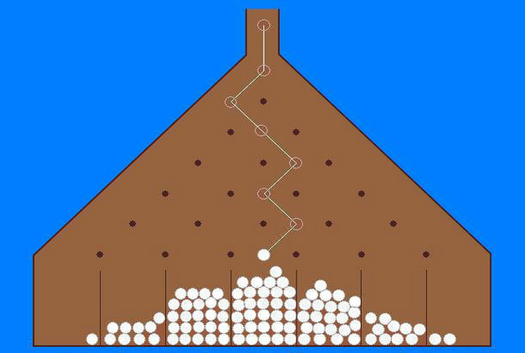

# Máquina Virtual de Galton
Este proyecto consiste en un simulador de una máquina de Galton, esto es una
máquina con forma de triángulo que contiene en su interior una serie de puntos
que interfieren con una bola que se lanza desde la cuspide del triángulo haciendo
que esta tenga una probabilidad de 50-50 de que se desplace a la derecha o a la
izquierda.

El resultado termina tendiendo a una distribución gaussiana.

Aquí inserto una imagen para representativa de la máquina en cuestión.

### Instalación y uso
Para compilar este proyecto se deberá usar el comando

    make all

el cual se encargará de compilar y testear el programa generado.

Para ejecutar el programa se deberá ejecutar este otro comando

    ./galton_machine <nodes> <throws>

donde `nodes` es un parámetro opcional que por defecto toma el valor 10 y `throws`
es otro parámetro opcional con valor por defecto 1000.
